<!--

  

-->

<h3 align="center">
  Software Engineer
</h3>

  
   
  

### ℹ️ About me

- 👋 Hi, I’m Emerson — a Software Engineer with a degree in Information Systems.
- 👨‍💻 I specialize in Python and Node.js for backend development.
- 🦀 Passionate about Rust and always exploring its potential.
- 🤓 Neovim user and Arch Linux user — by the way.

### 🔭 I’m currently working on

- [charlene](https://github.com/emersonmx/charlene)
- [gdfmt](https://github.com/emersonmx/gdfmt)
- [tp](https://github.com/emersonmx/tp)
- [skelly](https://github.com/emersonmx/skelly)

### 🌱 I’m currently learning

- Async programming with Rust
- CLI and TUI programming with Rust

### 📫 How to reach me

- [LinkedIn](https://www.linkedin.com/in/emersonmx/)

## 📌 Pinned Repositories

<!--
**emersonmx/emersonmx** is a ✨ _special_ ✨ repository because its `README.md` (this file) appears on your GitHub profile.

Here are some ideas to get you started:

- 🔭 I’m currently working on ...
- 🌱 I’m currently learning ...
- 👯 I’m looking to collaborate on ...
- 🤔 I’m looking for help with ...
- 💬 Ask me about ...
- 📫 How to reach me: ...
- 😄 Pronouns: ...
- ⚡ Fun fact: ...
-->
